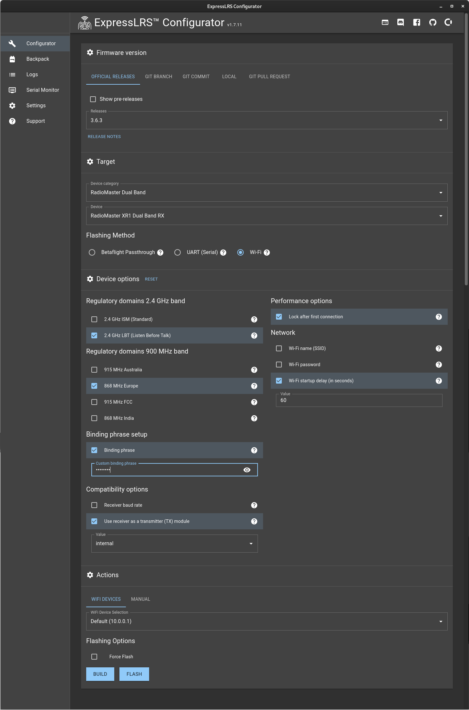
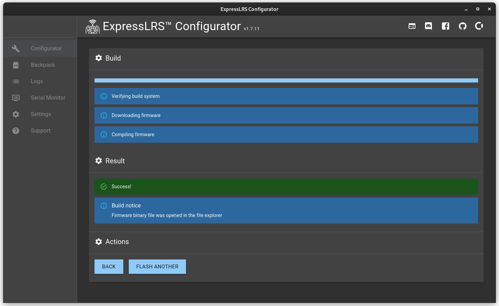
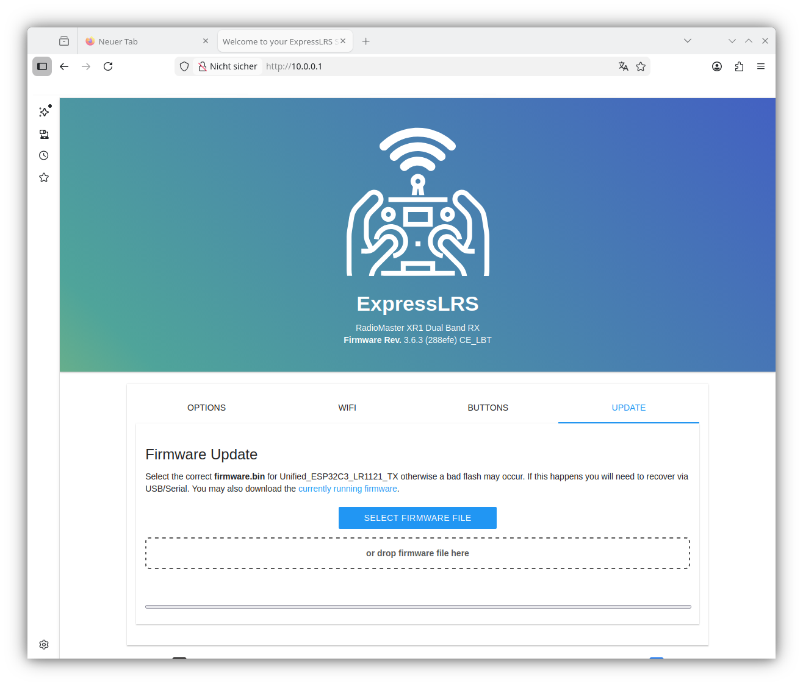
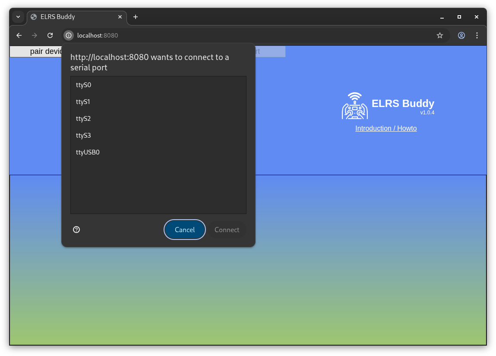
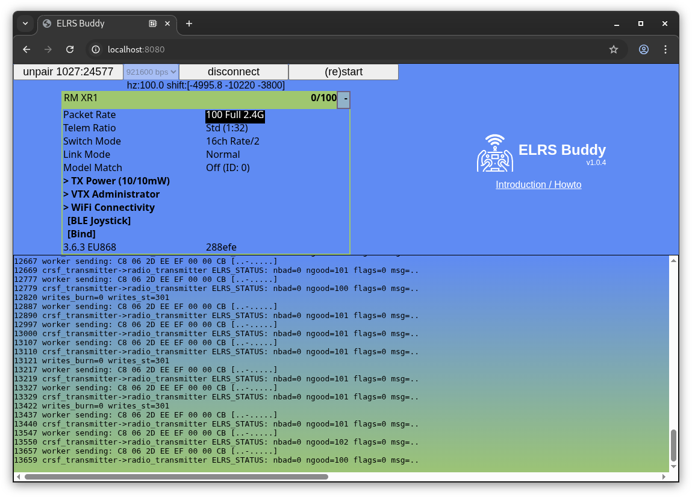

# ELRS HowTo

Dieses HowTo zeigt die Konfiguration und Verdrahtung einen Empfängers als Sendemodul an TXos.

---

## RX as TX Firmware bauen

Als Beispiel dient hier ein Radiomaster XR1 2.4 GHz Empfänger.

Installieren sie den ELRS Configurator wie auf der ELRS Seite beschrieben:
https://www.expresslrs.org/quick-start/getting-started/

Nach dem Starten mussen Sie zuerst in den **[Settings]** den Experten Mode einschalten.

Dann wird der Empfänger wie folgt konfiguriert.

**Achtung: Das Beispiel gilt nur für den XR1 Empfänger und für Europa. Wenn Sie einen anderen Empfänger habe müssen Sie das entsprechende Target auswählen.**



Nach dem sie auf **[Build]** geklick haben wird die Firmware gebaut und runtergeladen.



---

## RX as TX Firmware auf den Empfänger laden

Am einfachsten ist es den Empfänger über WiFi zu flashen.

Dazu schließen Sie den Empfänger and die Versorgungsspannung an und warten eine Minute. Der Empfänger wechselt in den WiFi mode und zeigt dies durch die LED an. Im Falle des XR1 blinkt die LED grün.

Verbinden sie nun den PC mit dem vom Empfänger aufgespannten WiFi Hotspot.

Öffnen Sie den Webbrowser und geben als Adresse htt://10.0.0.1 an.



---

## Empfänger als Sender mit ELRSBuddy konfigurieren

## ELRSBuddy installieren

Eine Instanz von ELRSBuddy ist unter https://fourflies.mooo.com/elrsbuddy/ zu erreichen.

**Achtung: Nicht jeder WebBrowser funktioniert. Google Chrome geht, Firefox funktioniert bei mir nicht.**

Man kann aber auch eine lokale Installation starten:

```
$ unzip elrsbuddy-main.zip 
Archive:  elrsbuddy-main.zip
01cead41d79f1f9179734d48261f5c901656bc7b
   creating: elrsbuddy-main/
  inflating: elrsbuddy-main/.gitignore  
  inflating: elrsbuddy-main/LICENSE  
  inflating: elrsbuddy-main/README.md  
   creating: elrsbuddy-main/img/
  inflating: elrsbuddy-main/img/logotype.svg  
  inflating: elrsbuddy-main/package-lock.json  
  inflating: elrsbuddy-main/package.json  
   creating: elrsbuddy-main/src/
  inflating: elrsbuddy-main/src/elrsV3.lua  
  inflating: elrsbuddy-main/src/index.html  
  inflating: elrsbuddy-main/src/index.js  
  inflating: elrsbuddy-main/src/worker.js  
  inflating: elrsbuddy-main/webpack.config.js  

$ mv elrsbuddy-main ~/elrsbuddy
```

**Falls noch keine Docker installation existiert kann diese wie folgt nachinstalliert werden:**

```
$ sudo apt remove docker docker-engine docker.io containerd runc

$ sudo apt update

$ sudo apt install apt-transport-https ca-certificates curl gnupg lsb-release
Reading package lists... Done
Building dependency tree... Done
Reading state information... Done
...ZUR ÜBERSICHTLICHKEIT ZEILEN GELÖSCHT... 

$ curl -fsSL https://download.docker.com/linux/debian/gpg | sudo gpg --dearmor -o /usr/share/keyrings/docker-archive-keyring.gpg

$ sudo apt update
$ sudo apt install docker-ce docker-ce-cli containerd.io docker-compose-plugin
Reading package lists... Done
Building dependency tree... Done
Reading state information... Done
...ZUR ÜBERSICHTLICHKEIT ZEILEN GELÖSCHT...
```

**Danach wird die Docker Umgebung gestartet:**

```
$ sudo docker run -v ~/elrsbuddy:/eb -w /eb --name eb -ti --rm -p 8080:8080 node /bin/bash
Unable to find image 'node:latest' locally
latest: Pulling from library/node
89edcaae7ec4: Pull complete 
514a5393d1c3: Pull complete 
86c20919419f: Pull complete 
bbceb0035429: Pull complete 
c4773027f0a7: Pull complete 
6bc9f599b3ef: Pull complete 
6dc8224e38b6: Pull complete 
073cbdc3d24d: Pull complete 
c15c80d287d2: Download complete 
e6f8c6ec44f3: Download complete 
Digest: sha256:3523df9d45c0280f49f4b503c7e2d354eeab5d676017488dd082188a0f09f99a
Status: Downloaded newer image for node:latest
root@a91161e9dd98:/eb# 
```

**Jetzt ist man in der Docker Umgebung und kann ELRSbuddy starten:**

```
root@a91161e9dd98:/eb# npm install

added 316 packages, and audited 317 packages in 2s

61 packages are looking for funding
  run `npm fund` for details

7 vulnerabilities (3 low, 4 high)

To address all issues, run:
  npm audit fix

Run `npm audit` for details.
npm notice
npm notice New minor version of npm available! 11.8.0 -> 11.9.0
npm notice Changelog: https://github.com/npm/cli/releases/tag/v11.9.0
npm notice To update run: npm install -g npm@11.9.0
npm notice
root@a91161e9dd98:/eb# npm start

> elrsbuddy@1.0.4 start
> webpack-dev-server --open --mode development --config webpack.config.js
<i> [webpack-dev-server] Project is running at:
<i> [webpack-dev-server] Loopback: http://localhost:8080/, http://[::1]:8080/
<i> [webpack-dev-server] On Your Network (IPv4): http://172.17.0.2:8080/
<i> [webpack-dev-server] Content not from webpack is served from '/eb/public' directory
assets by path *.js 347 KiB
  asset wasmoon-web.js 331 KiB [emitted] (name: build)
  asset worker.js 15.5 KiB [emitted] [from: src/worker.js] [copied]
  asset _9995.wasmoon-web.js 861 bytes [emitted]
asset elrsV3.lua 28.9 KiB [emitted] [from: src/elrsV3.lua] [copied]
asset index.html 17.4 KiB [emitted] [from: src/index.html] [copied]
asset logotype.svg 10 KiB [emitted] [from: img/logotype.svg] [copied]
runtime modules 31.6 KiB 15 modules
cacheable modules 260 KiB
  modules by path ./node_modules/ 257 KiB
    modules by path ./node_modules/webpack-dev-server/client/ 84.8 KiB 8 modules
    modules by path ./node_modules/webpack/hot/*.js 5.17 KiB
      ./node_modules/webpack/hot/dev-server.js 1.94 KiB [built] [code generated]
      ./node_modules/webpack/hot/log.js 1.73 KiB [built] [code generated]
      + 2 modules
    ./node_modules/wasmoon/dist/index.js 148 KiB [built] [code generated]
    ./node_modules/events/events.js 14.5 KiB [built] [code generated]
    ./node_modules/ansi-html-community/index.js 4.16 KiB [built] [code generated]
  ./src/index.js 3.16 KiB [built] [code generated]
  url (ignored) 15 bytes [built] [code generated]
  module (ignored) 15 bytes [built] [code generated]
webpack 5.98.0 compiled successfully in 131 ms
```

---

## Verdrahtung mit FTDI Interface

Der Empfänger wird über ein FTDI Interface per USB an den PC angeschlossen.

```
Empfänger -  ----- FTDI GND
Empfänger +  ----- FTDI 3v3
Empfänger Tx ----- FTDI RxI
Empfänger Rx ----- FTDI TxO
```


---

## Konfiguration des Empfängers als Sender im 2.4GHz Bereich

Öffnen Sie den Webbrowser und geben als Adresse http://localhost:8080 ein

Auf **[pair device]** klicken und den entsprechenden Port auswählen.



Die Bedienung erfolgt über die Cursortasten.



---

## Kanalbelegung von TXos mit CRSF Protokoll und ELRS

ExpressLRS verwendet Kanal 5 als "arming" Indikator. Daher muss der Kanal 5, falls er benötigt wird, im Empfänger auf einen anderen Kanal umgelegt werden.

TXos unterstützt zwei arming Methoden.

### ELRS bis Version 3

TXos Protokoll: **CRSF**

Arming über Kanal 5.

```
TXos Kanäle 1-4 und 6-12 werden durchgängig unterstützt.
TXos Kanal 5 wird über den Motor Stop Zustand gesteuert.
Siehe Bedienungsanleitung "Motor Aus" Funktion.

Motor Stop Funktion aktiviert ==> disarmed
Motor Stop Funktion aus ==> armed

ELRS Kanal 13 enthält das Signal von TXos Kanal 5. Daher sollte im Empfänger Kanal 13 auf Ausgang 5 gemapped werden.

TXos Kanäle 14-16 sind fix auf 1500 Mikrosekunden.
```

### ELRS ab Version 4

TXos Protokoll: **CRS4**

Arming über eigenen Indikator im CRSF Protokoll.

```
TXos Kanäle 1-12 werden durchgängig unterstützt.
TXos Kanäle 13-16 sind fix auf 1500 Mikrosekunden.
```
