# TXos Bedienungsanleitung

Diese Anleitung beschreibt die TXos Version 0.5.9 (August 2025)

---

# Inhalt

[Grundsätzliche Bedienung](#grundsätzliche-bedienung) 
[Konzept](#konzept) 
[Blockschaltbild](#blockschaltbild) 
[Schalter](#schalter) 
[Hauptbildschirm](#hauptbildschirm) 

[Systemeinstellungen](#systemeinstellungen) 

[Modellauswahl](#modellauswahl) 
[Import/Export](#importexport) 
[Servo Monitor](#servo-monitor) 
[Schalter Anzeige](#schalter-anzeige) 
[Empfänger Binden](#empfänger-binden) 
[Reichweiten Test](#reichweiten-test) 
[Mode Zuordnung](#mode-zuordnung) 
[Kalibrieren](#kalibrieren) 
[Trimmung Kalibrieren](#trimmung-kalibrieren) 
[Batterie Warnung](#batterie-warnung) 
[Statistiken](#statistiken) 
[Servo Test](#servo-test) 

[Modelleinstellungen](#modelleinstellungen) 

[Modell](#modell) 
[Trimspeicher](#trimmspeicher) 
[Geber Limit](#geber-limit) 
[Geber Umkehr](#geber-umkehr) 
[Geberschalter](#geberschalter) 
[Schaltkanal](#schaltkanal) 
[Kanal Zuordnung](#kanal-zuordnung) 
[Kanal Verzögerung](#kanal-verzögerung) 
[Landeklappen](#landeklappen) 
[Flugphasen](#flugphasen) 
[Phasentrimm](#phasentrimm) 
[Logikschalter](#logikschalter) 
[Dual Rate & Expo](#dual-rate--expo) 
[Mischer](#mischer) 
[Motor Aus](#motor-aus) 
[Timer](#timer) 
[Servo Zuordnung](#servo-zuordnung) 
[Servo Weg](#servo-weg) 
[Servo Umkehr](#servo-umkehr) 
[Servo Mitte](#servo-mitte) 
[Servo Verzögerung](#servo-verzögerung) 
[Servo Limit](#servo-limit) 

---
## Grundsätzliche Bedienung
[Inhalt](#inhalt)

Die Bedienung erfolgt über einen Drück-Dreh-Steller. Beim Drücken wird zwischen einem kurzen und einem langen Druck (> 300 Millisekunden) unterschieden.

* Drehen - Auswahl der Elemente oder Einstellen eines Wertes
* Kurzer Druck - ENTER
* Langer Druck - CLEAR

Bevor ein Modell programmiert und geflogen wird müssen die Analogeingänge (Kreuzknüppel, Potentiometer und analoge Trimmhebel) kalibriert werden.

---
### Erstmalige Knüppel kalibrierung

Die Funktion zum Kalibrieren der Kreuzknüppel und Potentiometer finden Sie in den Systemeinstellungen.

siehe [Knüppel kalibrierung](#kalibrieren)

---
### Erstmalige Trimm kalibrierung

Die Funktion dazu finden Sie wieder in den Systemeinstellungen.

siehe [Trimm kalibrierung](#trimmung-kalibrieren)

---

## Konzept
[Inhalt](#inhalt)

TXos unterstützt bis zu 9 Eingabekanäle (In1-In9) und 9 Ausgabekanäle (Servoausgänge S1-S9). Intern werden 12 logische Kanäle verwendet.

Die Eingabekanäle (IN1-IN9) werden über die Hauptsteuerfunktionen (Kreuzknüppel) sowie optionalen Linearschiebern, Potentiometern und Schaltern angesprochen.

Dabei sind die Eingabekanäle wie folgt mit den Bedienelementen verbunden:

* In1-In4 sind verbunden mit den beiden Kreuzknüppeln
* In5,In6 sind verbunden mit analogen Linearschiebern oder Potentiometer
* In7-In9 sind verbunden mit Schalten.

Achtung: Werden weniger als 2 Linearschieber/Potentiometer konfiguriert, so verschiebt sich die Nummerierung.

Die 4 Haupt Steuerfunktionen können mit den Eingabekanälen In1-In4 frei belegt werden.
In den Systemeinstellungen kann unter [Mode Zuordnung](#mode-zuordnung) die Voreinstellung festgelegt werden die für jedes neu angelegte Model verwerndet wird.
Die Einstellung kann aber für jedes Model unter Modeleinstellungen [Kanal Zuordnung](#kanal-zuordnung) geändert werden.

Intern werden 12 logische Kanäle verwendet. 
* Mot - Motor
* QR - Querruder
* QR2 - Querruder zweiter Kanal
* HR - Höhenruder
* SR - Seitenruder
* WK - Wölbklappen
* WK2 - Wölbklappen zweiter Kanal
* LK - Landeklappen
* LK2 - Landeklappen zweiter Kanal
* FWk - Fahrwerk
* K8 - Freier Kanal 8
* K9 - Freier Kanal 9

Mischer und andere Funktionen wie "Motor Aus" wirken auf die logischen Kanäle.

Nachdem alle Funktionen berechnet sind werden die logischen Kanäle 9 Servo Kanälen zugeordnet.

---
## Blockschaltbild
[Inhalt](#inhalt)

Die interne Verschaltung der einzelnen Module und deren Verarbeitungsreihenfolge:

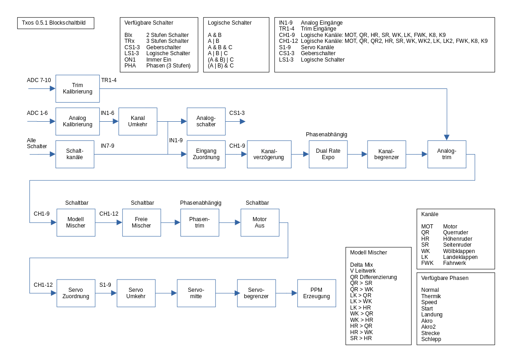

---
## Schalter
[Inhalt](#inhalt)

TXos unterstützt folgende Schalter:

* 2-Stufen Schalter  BIn (BI1,BI2...)
* 3-Stufen Schalter  TRn (TR3,TR4...)
* Geberschalter oder Kanalschalter CSn (CS1,CS2...)
* Logische Schalter: LSn (LS1,LS2...)
* “Immer Ein” Schalter: ON1
* Phasen Schalter (3-Stufig): PHA

Eine bestimmte Schalterstellung wird mit angehängtem Doppelpunkt und der Schalterposition angegeben.

Beispiel: 2-stufen Schalter 1 in Schalterstellung 0 
**BI1:0**

---
## Hauptbildschirm
[Inhalt](#inhalt)

* Warnmeldungen werden durch CLEAR (Langer Druck) gelöscht.
* Wird keine Meldung angezeigt wird durch einen langen Druck der Timer zurückgesetzt.
* Ein kurzer Druck ruft die Modelleinstellungen aus.

---
---
## Systemeinstellungen
[Inhalt](#inhalt)

Die Systemeinstellungen sind über den Menüpunkt "Systemeinstellungen" im Modell Menü erreichbar.

---
### Modellauswahl
[Inhalt](#inhalt)

Ein Arduino mit Mega 2560 Prozessor hat genügend Speicherkapazität für 14 Modelle.

Wählen Sie unter "Modellauswahl" das entsprechende Modell aus und drücken Sie ENTER.

In der folgenden Auswahl können die das Model laden, löschen oder für das kopieren vormerken.

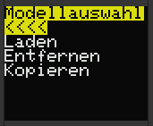

Achtung: Wenn sie "Entfernen" wählen wird das Model ohne weitere Abfrage gelöscht.

Wenn Sie "Kopieren" wählen wird das Modell als Quelle für die nächste "Einfügen" Operation ausgewählt.

Zum Kopieren eines Modells müssen sie:
1) das zu kopierende Modell auswählen und mit "Kopieren" als Quelle markieren.
2) den Ziel Speicherplatz auswählen und mit "Einfügen" das in (1) ausgewählte Modell in den ausgewählten Speicher kopieren.

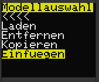

---
### Import/Export
[Inhalt](#inhalt)

Modelle können über die USB Schnittstelle auf einen PC gesichert und von dort wieder in den Speicher geladen werden.
Die Bedienung erfolgt über das PC Programm.

**Achtung: Die Funktion ist in TXos implementiert, das PC Programm jedoch noch nicht fertig.**

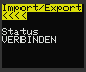

---
### Servo Monitor
[Inhalt](#inhalt)

Der Servo Monitor zeigt die aktuelle Position aller 9 Servos in Prozent an.

Mit dem Drück-Dreh Steller können Sie nach unten Scrollen um weitere Servos anzuzeigen.

---
### Schalter Anzeige
[Inhalt](#inhalt)

Der Schalter Monitor zeigt den aktuellen Zustand aller Schalter an.

Dazu zählen die Hardware-Schalter, sowie logische Schalter und Phasenschalter.

#### Benennung der Schalter

* Hardware Schalter. Die Schalternamen bestehen aus einer Typbezeichnung (BI für 2-Stufen Schalter, TR für 3-Stufen Schalter) und einer fortlaufenden Nummer.
* Geberschalter. Die Schalternamen sind "CS" und eine fortlaufende Nummer.
* Logische Schalter. Logische Schalter sind Verknüpfungen von bis zu 3 anderen Schaltern. Die Schalternamen sind "LS" und eine fortlaufende Nummer.
* Immer EIN Schalter. Dieser Schalter ist fix und kann dazu verwendet werden eine Funktion fest ein zu schalten. Der Name ist "ON". Der Zustand ist immer "1".
* Phasen schalter. "PHA" ist ein 3-Stufen Schalter und wird automatisch entsprechend der aktuellen Flugphase geschalten.

Mit dem Drück-Dreh Steller können Sie nach unten Scrollen um weitere Schalter anzuzeigen.

---
### Empfänger binden
[Inhalt](#inhalt)

TXos ünterstützt 2 Relais. Ein Relais dient dazu das HF Modul auszuschalten. Ein weiteres kann einen "Bind" Taster betätigen.

Je nach Sendemodul kann damit von TXos aus der Bindemodus ein- und ausgeschalten werden.

Wählen Sie dazu "Bind" aus und drücken Sie ENTER.

Beim Binden wird:
* Das HF Modul ausgeschaltet
* Das "Bind" Relais eingeschaltet
* Das HF Module wieder eingeschaltet 

Beim Verlassen dieser Funktion wird aus Sicherheitsgründen ein aktivierter Bind Vorgang abgebrochen.

---
### Reichweiten Test
[Inhalt](#inhalt)

Wenn der "Bind" Taster am Sendemodul einen Reichweiten Test einschaltet kann dies von TXos aus geschehen.

Wählen Sie dazu "Test" aus und drücken Sie ENTER.

Für den Reichweiten Test wird:
* Das "Bind" Relais eingeschaltet

Beim Verlassen dieser Funktion wird aus Sicherheitsgründen ein aktivierter Reichweiten Test automatisch beendet.

---
### Mode Zuordnung
[Inhalt](#inhalt)

Diese Funktion erlaubt die Zuweisung eines Eingangskanals "In1" - "In4" zu die 4 Hauptsteuerfunktionen "Mot", "QR", "HR" und "SR".

Zum Zuweisen eines Einganges zu einer Steuerfunktion wählen Sie die Steuerfunktion an und drücken ENTER.

Durch Drehen wird ein Eingang ausgewählt und duch ENTER bestätigt.

Beim Erstellen einen neuen Modells wird diese Zuordnung als Vorgabe verwendet.

---
### Kalibrieren
[Inhalt](#inhalt)

Die Kalibrierung legt die Mittelstellung sowie die Endpositionen der Kreuzknüppel und Potertiomenter fest. 
Die Kalibrierung erfolgt für die Analogeingänge 1 bis 6, also die Kreuzknüppel und optionale Linearschieber oder Potentiometer.

Die Trimmung wird getrennt kalibriert.

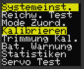

Unkalibrierte Eingänge zeigen einem Minimalwert von 0 und einen Maximalwert von 1023. 
Starten sie die Kalibrierung mit ENTER nachdem Sie "Start" ausgewählt haben.

Das Display zeigt jetzt "CENTER" an. Bewegen Sie alle Kreuzknüppel und Potertiometer in die Mittelstellung.
Danch drücken Sie nochmals ENTER.

Das Display zeigt jetzt "MIN/MAX" an. Bewegen Sie alle Kreuzknüppel und Potertiometer in beide Endstellungen.
Danach drücken Sie ENTER.

Vergessen Sie dabei nicht die Linearschieber und Potentiometer. Durch drehen des Drück-Dreh Stellers können Sie weitere Eingabekanäle anzeigen.

Das Display zeigt wieder "CALIB." an. Die Mittelstellung sowie die Endstellungen sind jetzt gespeichert.

---
### Trimmung Kalibrieren
[Inhalt](#inhalt)

Zur Kalibrierung der Trimmhebel verfahren Sie wie bei der Kalibrierung der Knüppel.

---
### Batterie Warnung
[Inhalt](#inhalt)

Einstellen der Warn- und Alarmschwellwerte und kalibrierung der gemessenen Batteriespannung.

Wird der Warnschwellwert unterschritten wechselt die Farbe der Batteriespannungs Anzeige von Grün auf Orange.

Wird der Alarmschwellwert unterschritten wechselt die Farbe der Batteriespannungs Anzeige von Orange auf Rot und es ertönt ein Alarmsignal von 5 kurzen Tönen alle 5 Sekunden.

"+/-" ist ein Korrekturwert mit dem die angezeigte Spannung der wahren Batteriespannung angeglichen wird. Dazu sollte die Batteriespannung im Betrieb gemessen und der Korrekturwert entsprechend angepasst werden.

Achtung: V0.5.4 enthält einen Fehler. Die aktuelle Spannung wird beim ändern des Korrekturwertes nicht automatisch aktualisiert.

---
### Statistiken
[Inhalt](#inhalt)

Dieses Modul zeigt interne statistiken an und ist normalerweise deaktiviert.

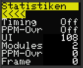

---
### Servo Test
[Inhalt](#inhalt)

Dieses Modul ist normalerweise deaktiviert.

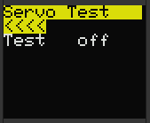

---
---
## Modelleinstellungen
[Inhalt](#inhalt)

Modelleinstellungen werden pro Modell gespeichert und geladen.

---
### Modell
[Inhalt](#inhalt)

Im "Modell" Modul werden der Modellname, der Leitwerksmischer, die Querruderdifferenzierung sowie alle vorgefertigten Flächenmischer eingestellt.

Für Funktionen die 2 getrennte Servos bedienen können, wie Querruder (QR), Wölbklappen (WK) und Landeklappen (LK) werden immer beide logische Kanäle gemischt. Also QR und QR2, WK und WK2 sowie LK und LK2. Ob der zweite Kanal dann auch wirklich verwendet wird, wird später in der Kanal - Servo zuordnung festgelegt.

---
### Trimmspeicher
[Inhalt](#inhalt)

Die Verwendung des Trimspeichers ist nicht so einfach auf den ersten Blick ersichtlich.

Das Problem beim analogen Trim ist, das für jedes Modell andere Werte gelten und diese beim Modelwechsel geändert werden müssen. Also Wert merken, Modell wechseln, neuen Wert für dieses Modell einstellen. Dies ist nicht praktikabel.

Deshalb hat jedes Modell seinen eingenen separaten Trimspeicher. Der aktuelle Wert der Trimmung besteht aus dem Wert der analogen Trimschieber plus dem Wert aus dem Trimspeicher.

Die Anzeige des Trimspeichers sieht wie folgt aus:

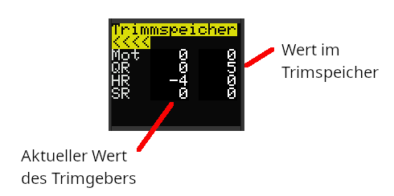

Wird während eines Fluges die Trimmung verstellt und der Wert soll in den Trimspeicher übernommen werden, passiert das einfach durch zurückstellen des Trimschiebers auf neutral, während man sich im Trimspeicher befindet.

Die linke Spalte zeigt den aktuellen Wert der Trimschieber. Die rechte Spalte den Wert des Trimspeichers für das aktuelle Modell. Im obigen Bild steht also der HR Trim auf -4 und es ist kein Wert für HR im Trimspeicher. 
Um den aktuellen Wert der Trimmung in den Trimspeicher zu übernehmen braucht nur der Trimschieber auf Mittelstellung geschoben werden.

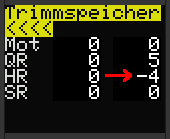

Der Wert der Trimmung wird auf den Trimspeicher aufaddiert, bzw davon abgezogen. Man kann also nach jedem Flug, wenn die Trimmung verändert wurde, einfach den Trimspeicher aktualisieren und den Trim für den nächsten Flug oder das nächste Modell auf Mittelstellung setzen.

Der Trimspeicher kann auch manuell geändert und zurückgesetzt werden.

Dazu den Kanal auswählen und ENTER drücken. Ein langer druck auf den Drück-Dreh Steller setzt den Wert auf 0 zurück.

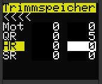

---
### Geber Limit
[Inhalt](#inhalt)

Analoggeber (In1-In6) Wegbegrenzung in Prozent.

Bereich: -125 % bis +125 % 
Einstellung bei einem neuen Modell: +/- 100 %

Diese Funktion wird im Normalfall nicht gebraucht. Ein Limit sollte über Servolimit eingestellt werden.

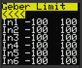

---
### Geber Umkehr
[Inhalt](#inhalt)

Analoggeber (In1-In6) Wirkrichtungsumkehr.

Einstellung bei einem neuen Modell: Aus

Diese Funktion wird im Normalfall nicht gebraucht. Eine Richtungsumkehr sollte über Servoreverse eingestellt werden.

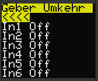

---
### Geberschalter
[Inhalt](#inhalt)

Ansteuerung eines Schalters über einen analogen Eingang.

Geberschalter sind 2-Stufen Schalter deren Schaltstellung vom Wert eines analogen Eingangs abhängig ist. 
Im Beispiel wird der Schalter CS1 von 0 auf 1 geschalten wenn der Wert des Eingangs In1 größer -90 % ist.

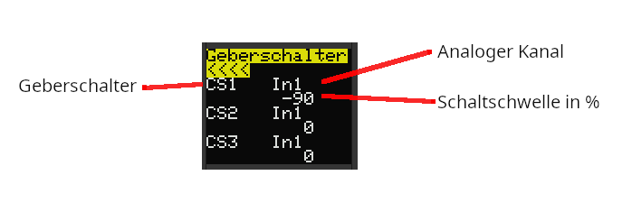

---
### Schaltkanal
[Inhalt](#inhalt)

Ansteuerung eines analogen Kanals (In7-In9) über einen mechanischen oder logischen Schalter.

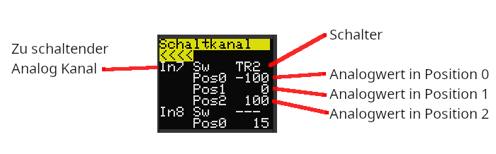

---
### Kanal Zuordnung
[Inhalt](#inhalt)

Zuordnung der Eingabekanäle zu den internen logischen Kanälen.

Die Standard Zuordnung für ein neues Modell wird in den Systemeinstellungen unter [Mode Zuordnung](#mode-zuordnung) vorgegeben.

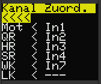

---
### Kanal Verzögerung
[Inhalt](#inhalt)

Die Geschwindigkeit der Bewegung jedes Kanals kann auf bis zu 10 Sekunden (von 0 bis 100%) veringert werden. 
Eingestellt wird die Zeit der Bewegung von 0 bis 100% in Sekunden, jeweils getrennt für beide Richtungen.

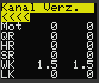

---
### Landeklappen
[Inhalt](#inhalt)

Landeklappen (Airbrakes).

Diese Einstellungen wirken auf die logischen Kanäle LK und LK2. 
Der Geber für die Landeklappen wird im Menü [Kanal Zuordnung](#kanal-zuordnung) zugeordnet. 
Eine Verzögerung der Bewegung wird im Menü [Kanal Verzögerung](#kanal-verzögerung) eingestellt 

Landeklappen Einstellungen:

* Aktiv: Schalter zur aktivierung der Landeklappen.
* Aus Pos: Diese Position wird angefahren wenn die Landeklappen nicht aktiviert sind.
* Umkehr: Umkehrung der Wirkrichtung.

Einstellungen bei einem neuen Modell:

* Aktiv: Kein Schalter (nicht aktiv)
* Aus Pos: 0%
* Umkehr: Aus

---
### Flugphasen
[Inhalt](#inhalt)

TXos unterstützt bis zu drei Flugphasen.

In diesem Menüpunkt wird der Schalter sowie die Namen der Flugphasen eingestellt.

Verfügbare Flugphasen sind:
* Normal
* Thermik
* Speed
* Start
* Landung
* Akro
* Akro 2
* Strecke
* Schlepp

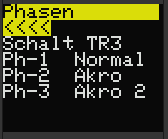

---
### Phasentrimm
[Inhalt](#inhalt)

Die Steuerfunktionen QR, HR, WK und LK können für jede Flugphase einzeln getrimmt werden.

Die beiden QR Flächen werden dabei gleichsinning und nicht gegensinning wie bei der normalen Trimmung verstellt.

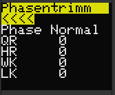

---
### Logikschalter
[Inhalt](#inhalt)

TXos unterstützt bis zu 3 Logikschalter. 
Logikschalter sind boolsche Verknüpfungen von bis zu 3 anderen Schaltern.

Folgende Verknüpfungen sind möglich: 
( "&" steht für "und", "|" steht für "oder" )
* A & B
* A | B
* A & B & C
* A | B | C
* (A & B) | C
* (A | B) & C

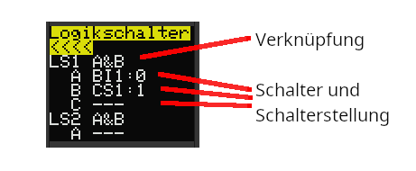

---
### Dual rate & Expo
[Inhalt](#inhalt)

Für die Hauptfunktionen QR, HR und SR stehen phasenabhängige Wegverkürzungen und Exponentialfunktionen zur verfügung.

**Dual Rate:**

Bereich: 0 % bis 100 % 
Einstellung bei einem neuen Modell: 100 %

**Exponentialfunktion:**

Bereich: 0 % bis 100 % 
Einstellung bei einem neuen Modell: 0 %

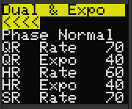

---
### Mischer
[Inhalt](#inhalt)

TXos unterstützt 3 freie Mischer.

Der Mischer wird aktiviert wenn der Mischer Schalter in der vorgegebenen Position steht. 
Quell und Zielkanäle können alle einfachen logischen Kanäle sein (Also nicht QR2,WK2 und LK2). 
Optional kann ein Offset auf den Mischerwert addiert werden. Der Offset kann auch negativ sein.

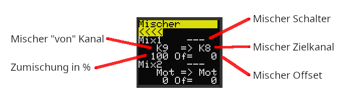

---
### Motor Aus
[Inhalt](#inhalt)

Beim aktivieren der "Motor Aus" Funktion wird der Motorkanal "Mot" auf einen vorher festgelegten Wert gesetzt. 
Der Wert lässt sich auch durch Mischer nicht ändern und verhindert das der Motor anläuft.

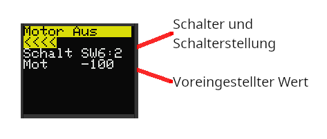

Bei aktivierter "Motor Aus" Funktion wird auf dem Hauptbildschirm ein grünes "Mot" angezeigt. 

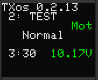

---
### Timer
[Inhalt](#inhalt)

Auf dem Hauptbildschirm wird eine abwärts zählende Uhr angezeigt. Der Startwert und der Aktivierungsschalter kann in diesem Menu eingestellt werden.

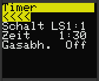

Tipp: Programmierung eines Timers mit Motor Stopp Funktion

Schalter BI1 soll in Stellung 1 die “Motor Aus” Funktion aktivieren und der Timer soll nur laufen wenn BI1 auf 0 steht und der Gas Knüppel über -90% steht.

1) Menü: Modelleinstell. => Motor aus 
Schalt auswählen, ENTER drücken und Schalter BI1 auswählen 
Den Schalter BI1 auf Stellung 1 schalten, dann nochmal ENTER drücken. 
Kanal Mot auf -100% stellen

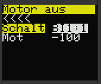

2) Menü: Modelleinstell. => Geberschalter 
CS1 auf den Eingabekanal stellen der den Motor steuert. In diesem Fall IN1. 
Schaltschwelle auf -90% stellen. 
Der Schalter CS1 schaltet jetzt auf 1 wenn der Gasknüppel über -90% bewegt wird. 

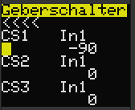

3) Menü: Modelleinstell. => Logikschalter 
Der Logikschalter LS1 soll auf 1 schalten wenn BI1 auf 0 steht und CS1 auf 1. 
LS1 auf A&B stellen 
A auf BI1:0 stellen   (Dazu muss der Schalter BI1 auf Stellung 0 bewegt werden) 
B auf CS1:1 stellen   (Dazu muss der Gasknüppel auf > -90% bewegt werden) 

4) Menü: Modelleinstell. => Timer 
Schalt auf LS1:1 stellen   (Dazu muss Schalter BI1 auf 0 stehen und Gasknüppel > -90%) 
Zeit auf die gewünschte Zeit einstellen.

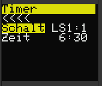

---
### Servo Zuordnung
[Inhalt](#inhalt)

Zuordnung der logischen Kanäle zu Servo Kanälen S1-S9.

Verfügbare logische Kanäle: 
Mot, QR, HR, SR, WK, LK, FWk, K8, K9, QR2, WK2, LK2

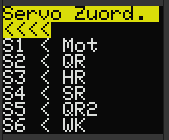

---
### Servo Weg
[Inhalt](#inhalt)

Servo S1-S9 Weg.

Verkürzung oder Erweiterung des Servowegs. 
Im Gegensatz zur Servo Wegbegrenzung wird hier der Weg eingestellt, den das Servo für die Vorgabe über den vollen Bereich (-100%,+100%) laufen soll.

Einstellung bei einem neuen Modell: -100% bis +100%

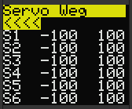

---
### Servo Umkehr
[Inhalt](#inhalt)

Servo S1-S9 Laufrichtung umkehren.

Einstellung bei einem neuen Modell: Aus

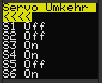

---
### Servo Mitte
[Inhalt](#inhalt)

Einstellung der Servo S1-S9 Mittelstellung in Prozent.

Bereich: -125 % bis +125 % 
Einstellung bei einem neuen Modell: 0 %

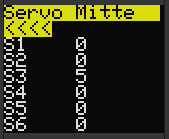

---
### Servo Verzögerung
[Inhalt](#inhalt)

Servo S1-S9 Verzögerung.

Die Geschwindigkeit der Bewegung jedes Servos kann auf bis zu 10 Sekunden (von 0 bis 100%) veringert werden. 
Eingestellt wird die Zeit der Bewegung von 0 bis 100% in Sekunden, jeweils getrennt für beide Richtungen.

Einstellung bei einem neuen Modell: 0 Sek.

---
### Servo Limit
[Inhalt](#inhalt)

Servo S1-S9 Wegbegrenzung in Prozent.

Bereich: -125 % bis +125 % 
Einstellung bei einem neuen Modell: +/- 125 %

