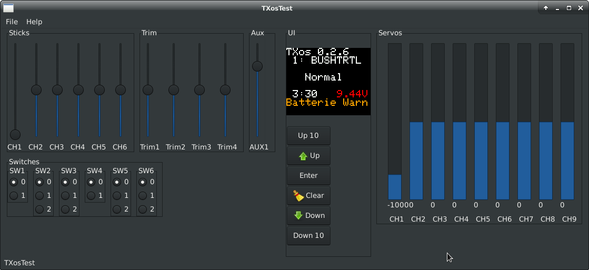

# TXos

## Unterstützte Hardware

### Arduino CPU Board

- Joy-IT ADR MEGA2560PRO

### Display

- ST7735 1,8" Color TFT Display

### Drück-Dreh Encoder

- Z.Bsp. von ALPS

### PPM HF-Module

- Z.Bsp. Spektrum Modul für Graupner MC-24 / MC-22

---
## Features

- 6 Analoge Eingänge 
- 4 Eingänge für analogen Trimm
- Trimmspeicher
- 6 Schalteingänge für 2 oder 3 Stufenschalter
- 12 Interne Kanäle  
    MOT, QR, QR2, HR, SR, WK, WK2, LK, LK2, Fwk, K8, K9  
    MOT = Motor  
    QR = Querruder  
    HR = Höhenruder  
    SR = Seitenruder  
    WK = Wölbklappen  
    LK = Landeklappen  
    Fwk = Fahrwerk  
    K8, K9 = freie Kanäle  
- 9 Servo Ausgänge
- PPM Erzeugung (22.5 mSec. Frames)
- Spannungsüberwachung
- Display 8 x 13 Zeichen
- Deutsche und Englische Benutzeroberfläche
- Bedienung über Drück-Dreh Encoder
- Piepser
- Relais zum Ausschalten der HF-Modul Stromversorgung
- Relais zum Bedienen eines Bind-Tasters
- Geber Umkehr und Limitter
- Delta Mischer und V-Leitwerks Mischer
- Fertige Mischer für  
    QR => SR  
    QR => WK  
    LK => QR  
    LK => WK  
    LK => HR  
    WK => QR  
    WK => HR  
    HR => QR  
    HR => WK  
    SR => HR  
- 3 Freie Mischer
- Kanal Laufzeit Verzögerung bis 10 Sek. (Ende zu Ende)
- 2 Geberschalter
- 3 Schaltkanäle
- 15 Modellspeicher
- 3 Flugphasen (aus Normal, Thermik, Speed, Start, Landung, Akro, Akro2, Strecke, Schlepp)
- Phasentrim für QR,WK,LK,HR
- Dual Rate und Exponential Funktion über Phasen für QR, SR und HR
- 2 Logische Schalter. (Boolsche Verknüpfung von bis zu 3 Schaltern)
- Freie Zuordnung der Geber zu Kanälen
- Freie Zuordnung der Kanäle zu Servo Ausgängen
- Servo Mitte, Umkehr und Limitter
- Timer
- Motor-Aus Schalter
- Bind Funktion (Falls Support vom HF-Modul besteht)
- Reichweiten Test Funktion (Falls Support vom HF-Modul besteht)
- Servo Monitor
- Schalter Monitor

---
## Installation

### Grundsätzliche Konfiguration:

In TXos/atmega2560/InputImp.h

Falls ein Potentiometer falsch angeschlossen ist kann hier die Wirkrichtung
umgekehrt werden.

`/* Invert raw channel values */`  
`#define INVERT_CH1`  
`#define INVERT_CH2`  
`#undef  INVERT_CH3`  
`#define INVERT_CH4`  

In test/TXosConfig.h

Hier werden eingestellt:

Anzahl der Analog Channels. Dazu zählen Analog Eingänge und Schaltkanäle.

ANALOG_CHANNELS

Anzahl der Schaltkanäle

SWITCHED_CHANNELS

Anzahl der Servo Kanäle

PPM_CHANNELS

### Schalter Konfiguration

SWITCHES  

MECHANICAL_SWITCHES  
MECHANICAL_SWITCHES_FIRST_IDX  

CHANNEL_SWITCHES  
CHANNEL_SWITCHES_FIRST_IDX  

LOGIC_SWITCHES  
LOGIC_SWITCHES_FIRST_IDX  

PHASE_SWITCHES  
PHASE_SWITCHES_FIRST_IDX  

SWITCH_CONFIGURATION  

### Ports und Analog Eingänge

Die folgenden defines legen die Arduino Port Nummern fest:

PORT_ANALOG_INPUT_COUNT  
PORT_ANALOG_INPUT  

PORT_TRIM_INPUT_COUNT  
PORT_TRIM_INPUT  

PORT_AUX_INPUT_COUNT  
PORT_AUX_INPUT  

PORT_SWITCH_INPUT_COUNT  
PORT_SWITCH_INPUT  

PORT_HF_RELAIS  
PORT_BIND_RELAIS  
PORT_BUZZER  

---
## Verzeichnisstruktur

---
## Übersetzen mit der Arduino IDE 

`cd TXos`  
`./mklinks`  

Dieses Kommando verlinkt die Dateien im `src` Verzeichnis nach `TXos`.

Mit der Arduino IDE kann dann in diesem Verzeichnis TXos compiliert werden.

---
## TXos Simulator

Der Simulator verwendet die `wxWidgets` library. Zum installieren:

`apt install gcc make libwxgtk3.0-gtk3-dev`

`cd src`  
`make clean`  
`make`  
`./TXosTest`  

---
## Unit test

`cd test`  
`make clean`  
`make unittest`  
`./TXosUnitTest`  

Achtung: `make clean unittest` funktioniert nicht!
