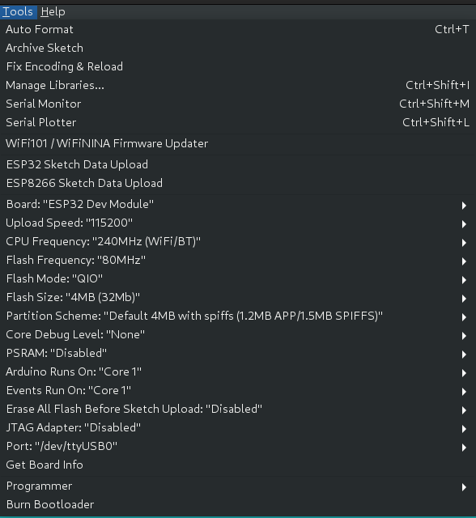

# TXos

[Bedienungsanleitung](MANUAL.md)

---
## Unterstützte Hardware

### Arduino CPU Board

- Joy-IT ADR MEGA2560PRO
- ESP32 DevKit 38 Pin (THIS IS EXPERIMENTAL)

### Display

- ST7735 1,8" Color TFT Display

### Drück-Dreh Encoder

- Z.Bsp. von ALPS

### PPM HF-Module

- Z.Bsp. Spektrum Modul für Graupner MC-24 / MC-22

---
## Features

- 6 Analoge Eingänge 
- 4 Eingänge für analogen Trimm
- Trimmspeicher
- 6 Schalteingänge für 2 oder 3 Stufenschalter
- 12 Interne Kanäle  
    MOT, QR, QR2, HR, SR, WK, WK2, LK, LK2, Fwk, K8, K9  
    MOT = Motor  
    QR = Querruder  
    HR = Höhenruder  
    SR = Seitenruder  
    WK = Wölbklappen  
    LK = Landeklappen  
    Fwk = Fahrwerk  
    K8, K9 = freie Kanäle  
- 9 Servo Ausgänge
- PPM Erzeugung (22.5 mSec. Frames)
- Spannungsüberwachung
- Display 8 x 13 Zeichen
- Deutsche und Englische Benutzeroberfläche
- Bedienung über Drück-Dreh Encoder
- Piepser
- Relais zum Ausschalten der HF-Modul Stromversorgung
- Relais zum Bedienen eines Bind-Tasters
- Geber Umkehr und Limitter
- Delta Mischer und V-Leitwerks Mischer
- Fertige Mischer für  
    QR => SR  
    QR => WK  
    LK => QR  
    LK => WK  
    LK => HR  
    WK => QR  
    WK => HR  
    HR => QR  
    HR => WK  
    SR => HR  
- 3 Freie Mischer
- Kanal Laufzeit Verzögerung bis 10 Sek. (Ende zu Ende)
- 3 Geberschalter
- 3 Schaltkanäle
- 14 Modellspeicher
- 3 Flugphasen (aus Normal, Thermik, Speed, Start, Landung, Akro, Akro2, Strecke, Schlepp)
- Phasentrim für QR,WK,LK,HR
- Dual Rate und Exponential Funktion über Phasen für QR, SR und HR
- 3 Logische Schalter. (Boolsche Verknüpfung von bis zu 3 Schaltern)
- Freie Zuordnung der Geber zu Kanälen
- Freie Zuordnung der Kanäle zu Servo Ausgängen
- Servo Mitte, Umkehr und Limitter
- Timer
- Motor-Aus Schalter
- Bind Funktion (Falls Support vom HF-Modul besteht)
- Reichweiten Test Funktion (Falls Support vom HF-Modul besteht)
- Servo Monitor
- Schalter Monitor
- Import und Export der Modelle zum PC über USB Schnittstelle

---
## Blockschaltbild der Funktionen

---
## Installation

### Übersetzen mit der Arduino IDE 

#### Für ADR MEGA2560PRO

Benötigte Arduino Libraries
- Adafruit ST7736 and ST7789 Library
- Adafruit GFX Library
- TO_BE_COMPLETED

`cd TXos`  
`./mklinks atmega2560`  

Dieses Kommando verlinkt die Dateien im `src` Verzeichnis nach `TXos`.

Fall noch keine lokale Konfigurationsdtei TXosLocalConfig.h existiert wird diese von einer Musterdatei kopiert und muss an die eigen Hardware konfiguration angepasst werden.

Mit der Arduino IDE kann dann in diesem Verzeichnis TXos compiliert werden.

Notwendige Einstellungen der Arduino IDE

TO_BE_COMPLETED

#### Für ESP32 (WARNING: EXPERMENTAL)

Benötigte Arduino Libraries
- TFT_eSPI
- TO_BE_COMPLETED

`cd TXos`  
`./mklinks esp32`  

Mit der Arduino IDE kann dann in diesem Verzeichnis TXos compiliert werden.

Notwendinge Einstellungen der Arduino IDE

---
### Grundsätzliche Konfiguration:

In TXos/InputImp.h

Falls ein Potentiometer falsch angeschlossen ist kann hier die Wirkrichtung
umgekehrt werden.

`/* Invert raw channel values */`  
`#define INVERT_CH1`  
`#define INVERT_CH2`  
`#undef  INVERT_CH3`  
`#define INVERT_CH4`  

---

In TXos/TXosLocalConfig.h

Hier werden eingestellt:

- Die Sprache der Benutzeroberfläche
- Das verwendete HF Modul
- Die Anzahl der PPM Kanäle
- Die Anzahl der Analog Kanäle
- Die Anzahl der Schalter (mechanische, logische und Sonderschalter)
- Die Anzahl der Flugphasen
- Die Anzahl der freien Mischer

---
## TXos Simulator

Der Simulator verwendet die `wxWidgets` library. Zum installieren:

`apt install gcc make libwxgtk3.0-gtk3-dev`

`cd src`  
`make clean`  
`make -j`  
`./TXosTest`  

---
## Unit test

`cd test`  
`make clean`  
`make -j unittest`  
`./TXosUnitTest`  

Achtung: `make clean unittest` funktioniert nicht!
