# Robbe Supra Umbau

Alles zerlegen, säubern und neu verdrahren.

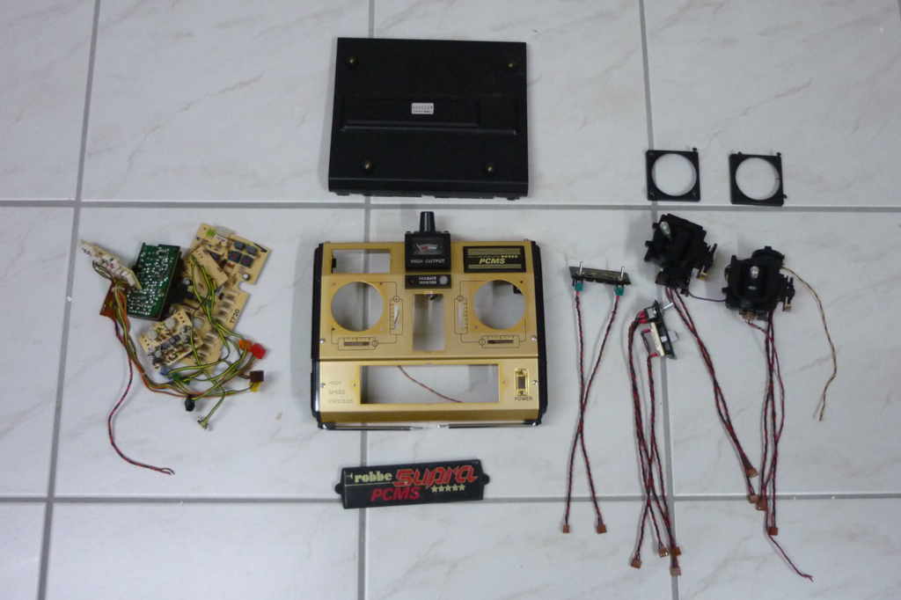

Die Platine.

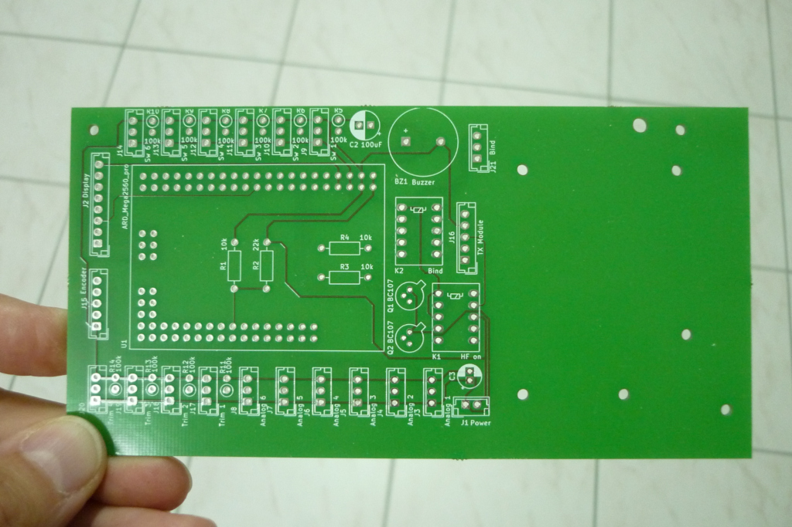

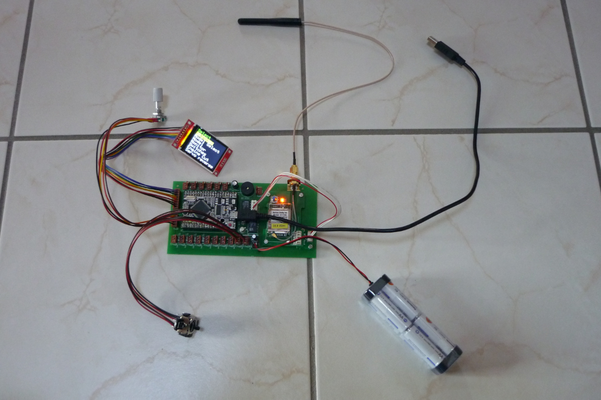

Bischen 2D gedrucke.

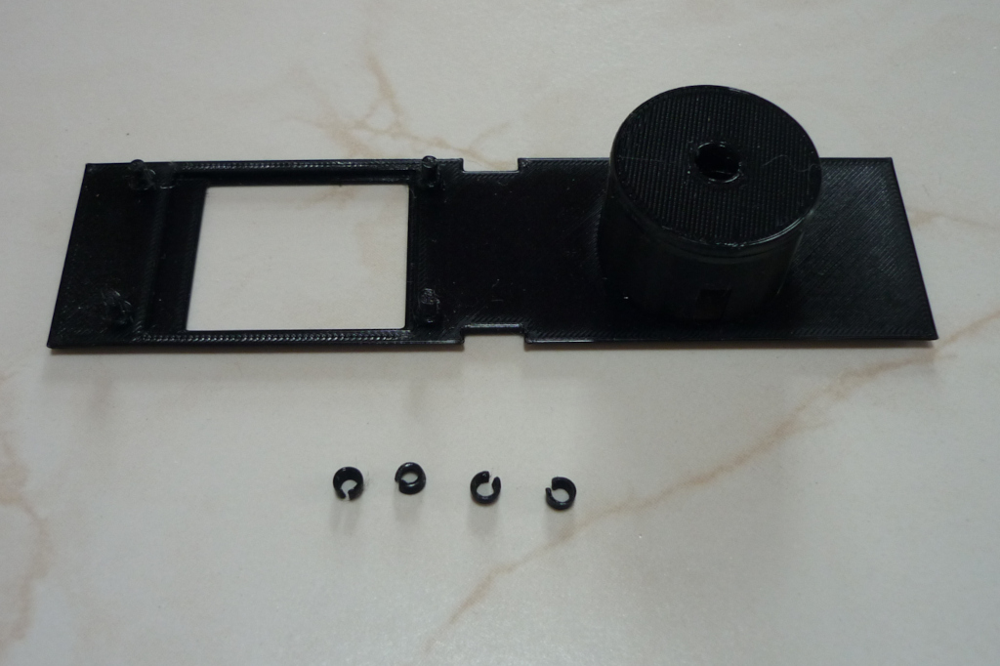

Display und Rotary Encoder

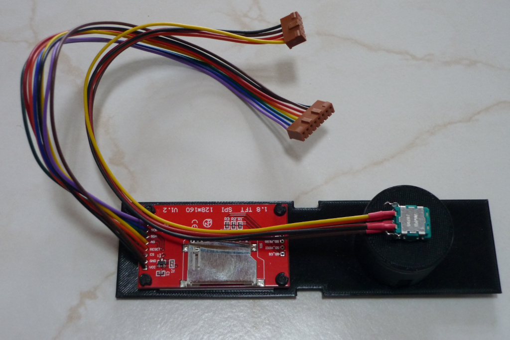

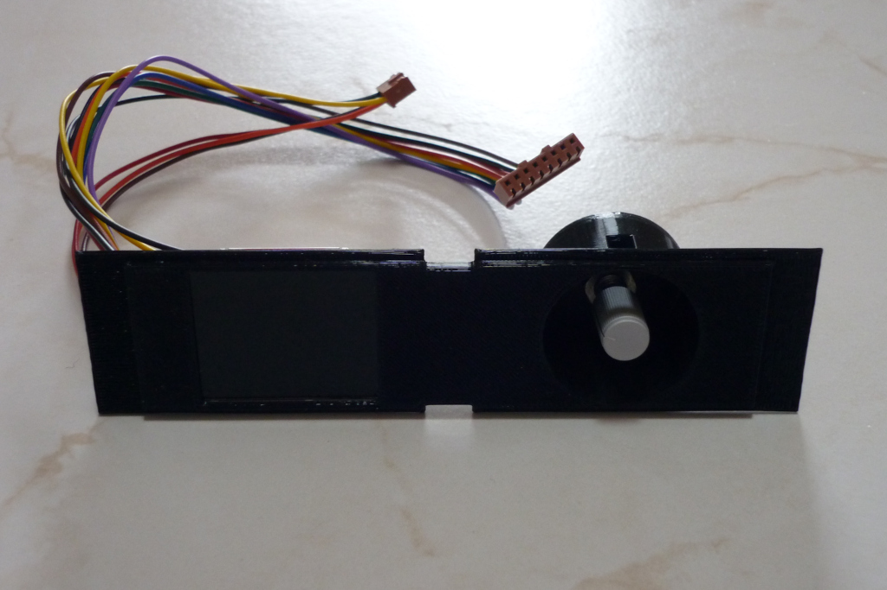

Erstmal alles leer...

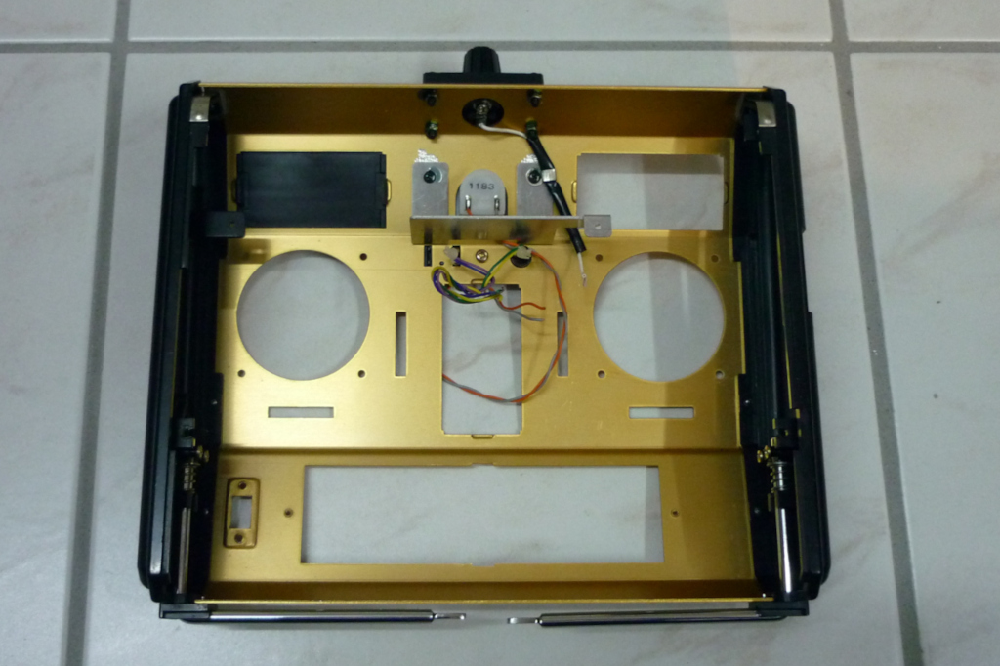

... aber schnell ...

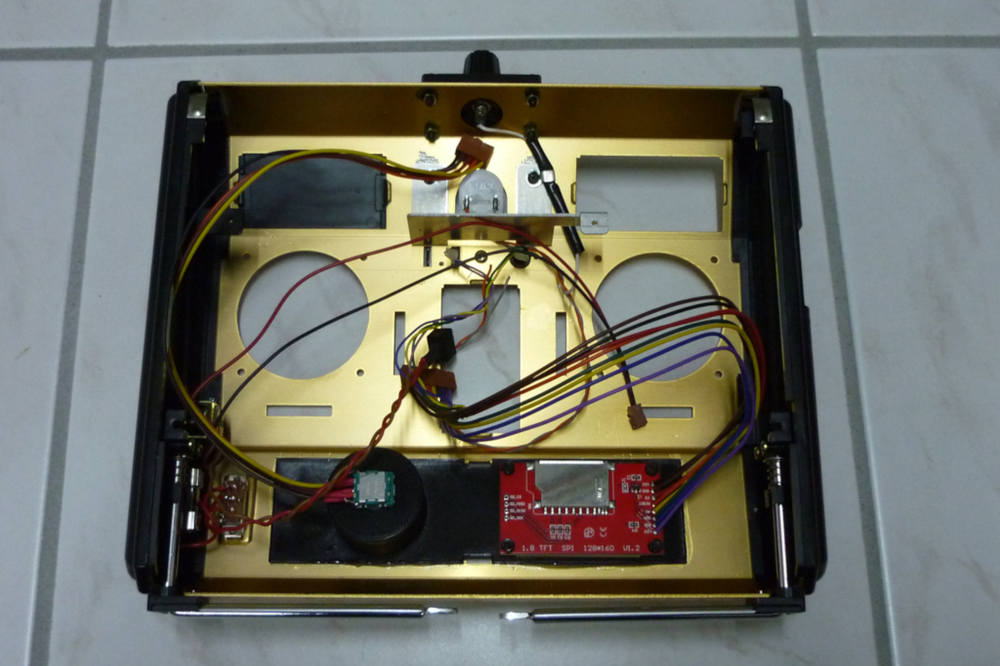

... wieder voll.

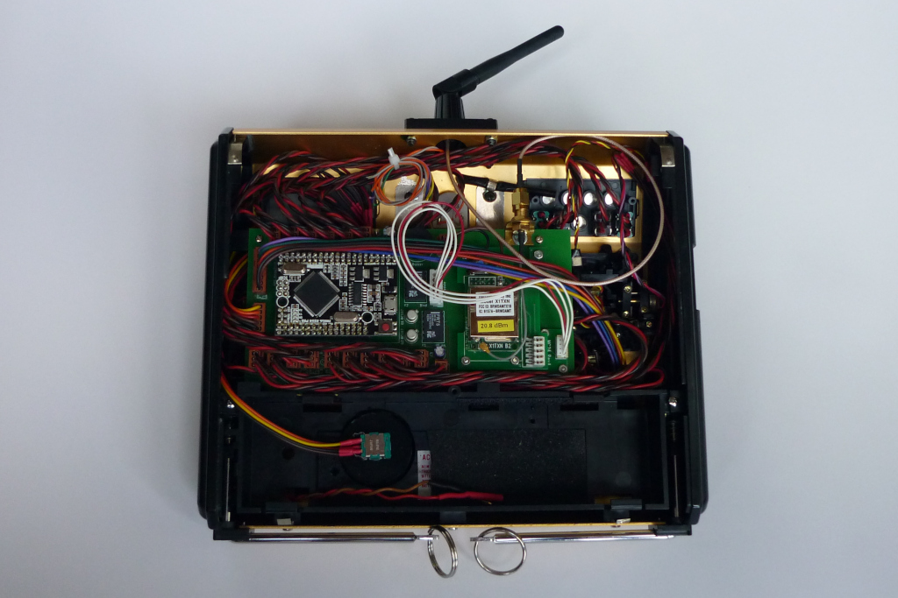

Von aussen nur durch die Antenne zu unterscheiden.

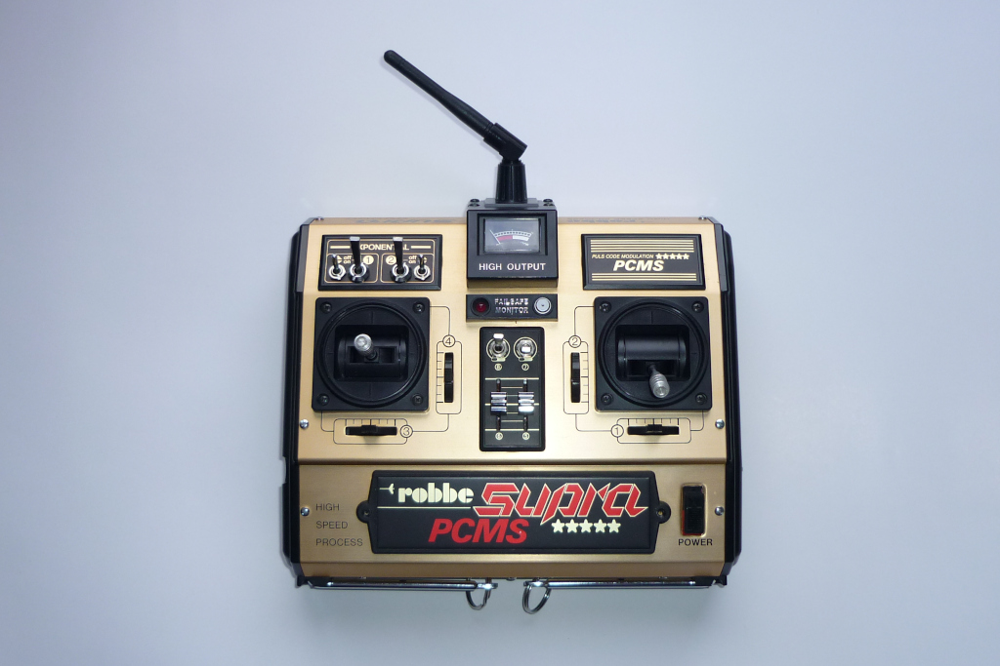

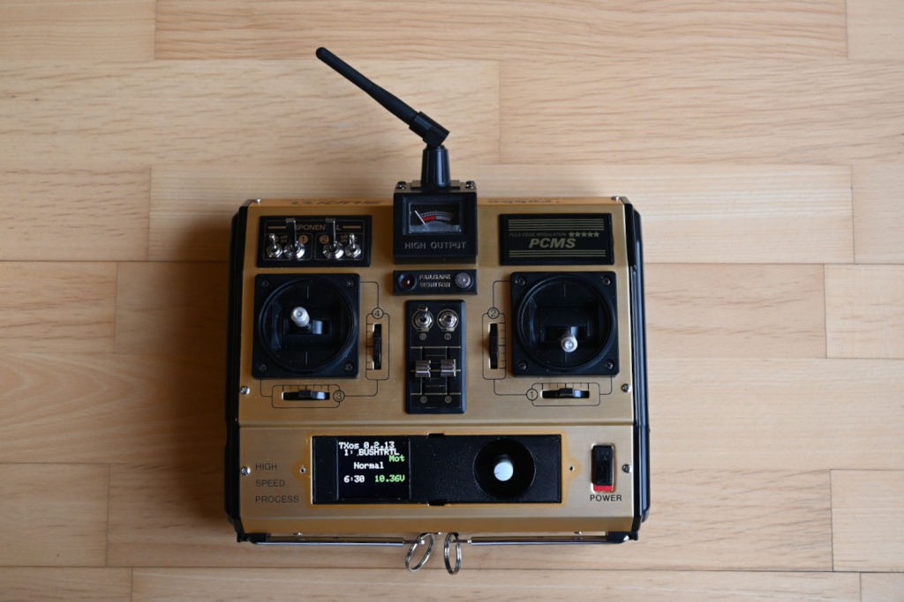

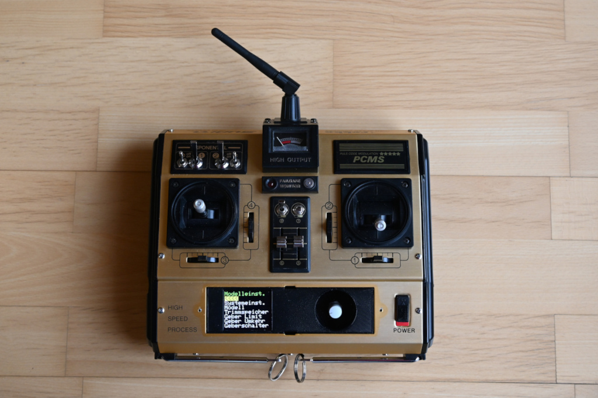